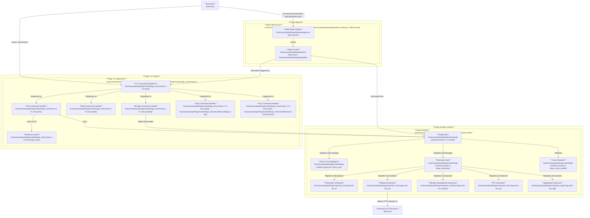

# Unnamed CodeViz Diagram

```mermaid
graph TD

    base.cv::user["**End User**<br>[External]"]
    base.cv::ext_http_services["**External HTTP Services**<br>[External]"]
    subgraph base.cv::forge_runtime_system["**Forge Runtime System**<br>[External]"]
        subgraph base.cv::forge_runtime["**Forge Runtime**<br>/Users/ryanoboyle/forge/crates/forge-runtime/Cargo.toml `forge-runtime`"]
            base.cv::forge_runtime_main["**Forge Main**<br>/Users/ryanoboyle/forge/crates/forge-runtime/src/main.rs `fn main()`"]
            base.cv::forge_runtime_deno_core["**Deno Core Integration**<br>/Users/ryanoboyle/forge/crates/forge-runtime/Cargo.toml `deno_core`"]
            base.cv::forge_runtime_extension_host["**Extension Host**<br>/Users/ryanoboyle/forge/crates/forge-runtime/src/main.rs `setup_extensions`"]
            base.cv::forge_runtime_fs_ext["**Filesystem Extension**<br>/Users/ryanoboyle/forge/crates/ext_fs/Cargo.toml `ext_fs`"]
            base.cv::forge_runtime_net_ext["**Network Extension**<br>/Users/ryanoboyle/forge/crates/ext_net/Cargo.toml `ext_net`"]
            base.cv::forge_runtime_window_ext["**Window Management Extension**<br>/Users/ryanoboyle/forge/crates/ext_window/Cargo.toml `ext_window`"]
            base.cv::forge_runtime_ipc_ext["**IPC Extension**<br>/Users/ryanoboyle/forge/crates/ext_ipc/Cargo.toml `ext_ipc`"]
            base.cv::forge_runtime_app_ext["**Application Extension**<br>/Users/ryanoboyle/forge/crates/ext_app/Cargo.toml `ext_app`"]
            base.cv::forge_runtime_crash_reporter["**Crash Reporter**<br>/Users/ryanoboyle/forge/crates/forge-runtime/src/crash.rs `setup_crash_handler`"]
            %% Edges at this level (grouped by source)
            base.cv::forge_runtime_main["**Forge Main**<br>/Users/ryanoboyle/forge/crates/forge-runtime/src/main.rs `fn main()`"] -->|"Initializes and manages"| base.cv::forge_runtime_deno_core["**Deno Core Integration**<br>/Users/ryanoboyle/forge/crates/forge-runtime/Cargo.toml `deno_core`"]
            base.cv::forge_runtime_main["**Forge Main**<br>/Users/ryanoboyle/forge/crates/forge-runtime/src/main.rs `fn main()`"] -->|"Initializes and manages"| base.cv::forge_runtime_extension_host["**Extension Host**<br>/Users/ryanoboyle/forge/crates/forge-runtime/src/main.rs `setup_extensions`"]
            base.cv::forge_runtime_main["**Forge Main**<br>/Users/ryanoboyle/forge/crates/forge-runtime/src/main.rs `fn main()`"] -->|"Initializes"| base.cv::forge_runtime_crash_reporter["**Crash Reporter**<br>/Users/ryanoboyle/forge/crates/forge-runtime/src/crash.rs `setup_crash_handler`"]
            base.cv::forge_runtime_extension_host["**Extension Host**<br>/Users/ryanoboyle/forge/crates/forge-runtime/src/main.rs `setup_extensions`"] -->|"Registers and exposes"| base.cv::forge_runtime_fs_ext["**Filesystem Extension**<br>/Users/ryanoboyle/forge/crates/ext_fs/Cargo.toml `ext_fs`"]
            base.cv::forge_runtime_extension_host["**Extension Host**<br>/Users/ryanoboyle/forge/crates/forge-runtime/src/main.rs `setup_extensions`"] -->|"Registers and exposes"| base.cv::forge_runtime_net_ext["**Network Extension**<br>/Users/ryanoboyle/forge/crates/ext_net/Cargo.toml `ext_net`"]
            base.cv::forge_runtime_extension_host["**Extension Host**<br>/Users/ryanoboyle/forge/crates/forge-runtime/src/main.rs `setup_extensions`"] -->|"Registers and exposes"| base.cv::forge_runtime_window_ext["**Window Management Extension**<br>/Users/ryanoboyle/forge/crates/ext_window/Cargo.toml `ext_window`"]
            base.cv::forge_runtime_extension_host["**Extension Host**<br>/Users/ryanoboyle/forge/crates/forge-runtime/src/main.rs `setup_extensions`"] -->|"Registers and exposes"| base.cv::forge_runtime_ipc_ext["**IPC Extension**<br>/Users/ryanoboyle/forge/crates/ext_ipc/Cargo.toml `ext_ipc`"]
            base.cv::forge_runtime_extension_host["**Extension Host**<br>/Users/ryanoboyle/forge/crates/forge-runtime/src/main.rs `setup_extensions`"] -->|"Registers and exposes"| base.cv::forge_runtime_app_ext["**Application Extension**<br>/Users/ryanoboyle/forge/crates/ext_app/Cargo.toml `ext_app`"]
        end
    end
    subgraph base.cv::forge_cli_system["**Forge CLI System**<br>[External]"]
        subgraph base.cv::forge_cli["**Forge CLI Application**<br>/Users/ryanoboyle/forge/crates/forge_cli/Cargo.toml `[[bin]]`, /Users/ryanoboyle/forge/crates/forge_cli/src/main.rs"]
            base.cv::forge_cli_dispatcher["**CLI Command Dispatcher**<br>/Users/ryanoboyle/forge/crates/forge_cli/src/main.rs `fn main()`"]
            base.cv::forge_cli_dev_cmd["**Dev Command Handler**<br>/Users/ryanoboyle/forge/crates/forge_cli/src/main.rs `fn cmd_dev()`"]
            base.cv::forge_cli_build_cmd["**Build Command Handler**<br>/Users/ryanoboyle/forge/crates/forge_cli/src/main.rs `fn cmd_build()`"]
            base.cv::forge_cli_bundle_cmd["**Bundle Command Handler**<br>/Users/ryanoboyle/forge/crates/forge_cli/src/main.rs `fn cmd_bundle()`"]
            base.cv::forge_cli_sign_cmd["**Sign Command Handler**<br>/Users/ryanoboyle/forge/crates/forge_cli/src/main.rs `fn cmd_sign()`, /Users/ryanoboyle/forge/crates/forge_cli/src/bundler/codesign.rs `sign`"]
            base.cv::forge_cli_icon_cmd["**Icon Command Handler**<br>/Users/ryanoboyle/forge/crates/forge_cli/src/main.rs `fn cmd_icon()`, /Users/ryanoboyle/forge/crates/forge_cli/src/bundler/mod.rs `IconProcessor`"]
            base.cv::forge_cli_runtime_locator["**Runtime Locator**<br>/Users/ryanoboyle/forge/crates/forge_cli/src/main.rs `fn find_forge_host()`"]
            %% Edges at this level (grouped by source)
            base.cv::forge_cli_dispatcher["**CLI Command Dispatcher**<br>/Users/ryanoboyle/forge/crates/forge_cli/src/main.rs `fn main()`"] -->|"Dispatches to"| base.cv::forge_cli_dev_cmd["**Dev Command Handler**<br>/Users/ryanoboyle/forge/crates/forge_cli/src/main.rs `fn cmd_dev()`"]
            base.cv::forge_cli_dispatcher["**CLI Command Dispatcher**<br>/Users/ryanoboyle/forge/crates/forge_cli/src/main.rs `fn main()`"] -->|"Dispatches to"| base.cv::forge_cli_build_cmd["**Build Command Handler**<br>/Users/ryanoboyle/forge/crates/forge_cli/src/main.rs `fn cmd_build()`"]
            base.cv::forge_cli_dispatcher["**CLI Command Dispatcher**<br>/Users/ryanoboyle/forge/crates/forge_cli/src/main.rs `fn main()`"] -->|"Dispatches to"| base.cv::forge_cli_bundle_cmd["**Bundle Command Handler**<br>/Users/ryanoboyle/forge/crates/forge_cli/src/main.rs `fn cmd_bundle()`"]
            base.cv::forge_cli_dispatcher["**CLI Command Dispatcher**<br>/Users/ryanoboyle/forge/crates/forge_cli/src/main.rs `fn main()`"] -->|"Dispatches to"| base.cv::forge_cli_sign_cmd["**Sign Command Handler**<br>/Users/ryanoboyle/forge/crates/forge_cli/src/main.rs `fn cmd_sign()`, /Users/ryanoboyle/forge/crates/forge_cli/src/bundler/codesign.rs `sign`"]
            base.cv::forge_cli_dispatcher["**CLI Command Dispatcher**<br>/Users/ryanoboyle/forge/crates/forge_cli/src/main.rs `fn main()`"] -->|"Dispatches to"| base.cv::forge_cli_icon_cmd["**Icon Command Handler**<br>/Users/ryanoboyle/forge/crates/forge_cli/src/main.rs `fn cmd_icon()`, /Users/ryanoboyle/forge/crates/forge_cli/src/bundler/mod.rs `IconProcessor`"]
            base.cv::forge_cli_dev_cmd["**Dev Command Handler**<br>/Users/ryanoboyle/forge/crates/forge_cli/src/main.rs `fn cmd_dev()`"] -->|"Uses to find"| base.cv::forge_cli_runtime_locator["**Runtime Locator**<br>/Users/ryanoboyle/forge/crates/forge_cli/src/main.rs `fn find_forge_host()`"]
        end
    end
    subgraph base.cv::forge_site["**Forge Website**<br>/Users/ryanoboyle/forge/site/package.json `forge-deno-site`"]
        subgraph base.cv::forge_site_web_server["**Static Web Server**<br>/Users/ryanoboyle/forge/site/package.json `astro preview`, /Users/ryanoboyle/forge/site/astro.config.mjs `defineConfig`"]
            base.cv::forge_site_web_server_engine["**Web Server Engine**<br>/Users/ryanoboyle/forge/site/package.json `astro preview`"]
            base.cv::forge_site_static_assets["**Static Assets**<br>/Users/ryanoboyle/forge/site/src/ `index.astro`, /Users/ryanoboyle/forge/site/public/"]
            %% Edges at this level (grouped by source)
            base.cv::forge_site_web_server_engine["**Web Server Engine**<br>/Users/ryanoboyle/forge/site/package.json `astro preview`"] -->|"Serves"| base.cv::forge_site_static_assets["**Static Assets**<br>/Users/ryanoboyle/forge/site/src/ `index.astro`, /Users/ryanoboyle/forge/site/public/"]
        end
    end
    %% Edges at this level (grouped by source)
    base.cv::user["**End User**<br>[External]"] -->|"Issues commands to"| base.cv::forge_cli_dispatcher["**CLI Command Dispatcher**<br>/Users/ryanoboyle/forge/crates/forge_cli/src/main.rs `fn main()`"]
    base.cv::user["**End User**<br>[External]"] -->|"Accesses documentation and information from"| base.cv::forge_site_web_server_engine["**Web Server Engine**<br>/Users/ryanoboyle/forge/site/package.json `astro preview`"]
    base.cv::forge_cli_dev_cmd["**Dev Command Handler**<br>/Users/ryanoboyle/forge/crates/forge_cli/src/main.rs `fn cmd_dev()`"] -->|"Runs"| base.cv::forge_runtime_main["**Forge Main**<br>/Users/ryanoboyle/forge/crates/forge-runtime/src/main.rs `fn main()`"]
    base.cv::forge_cli_bundle_cmd["**Bundle Command Handler**<br>/Users/ryanoboyle/forge/crates/forge_cli/src/main.rs `fn cmd_bundle()`"] -->|"Builds and bundles"| base.cv::forge_runtime_main["**Forge Main**<br>/Users/ryanoboyle/forge/crates/forge-runtime/src/main.rs `fn main()`"]
    base.cv::forge_site_static_assets["**Static Assets**<br>/Users/ryanoboyle/forge/site/src/ `index.astro`, /Users/ryanoboyle/forge/site/public/"] -->|"Generated from"| base.cv::forge_runtime_main["**Forge Main**<br>/Users/ryanoboyle/forge/crates/forge-runtime/src/main.rs `fn main()`"]
    base.cv::forge_site_static_assets["**Static Assets**<br>/Users/ryanoboyle/forge/site/src/ `index.astro`, /Users/ryanoboyle/forge/site/public/"] -->|"Generation triggered by"| base.cv::forge_cli_dispatcher["**CLI Command Dispatcher**<br>/Users/ryanoboyle/forge/crates/forge_cli/src/main.rs `fn main()`"]
    base.cv::forge_runtime_net_ext["**Network Extension**<br>/Users/ryanoboyle/forge/crates/ext_net/Cargo.toml `ext_net`"] -->|"Makes HTTP requests to"| base.cv::ext_http_services["**External HTTP Services**<br>[External]"]

```

---
*Generated by [CodeViz.ai](https://codeviz.ai) on 12/16/2025, 4:42:47 AM*
