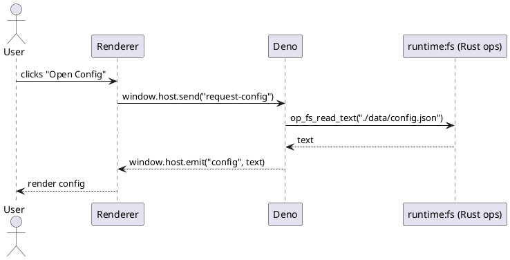

# SPEC-001-Deno-Rust Electron-like Frame

## Background

**Goal.** Build an Electron-like application frame that runs app logic with **Deno** and delegates privileged/low‑level work to **Rust**, while rendering UI with a native **WebView**. Emphasize minimal dependencies, direct & explainable control flow, and well-defined layers that compose into installable desktop apps and web apps.

**Why not Electron.** Electron ships a full Chromium + Node runtime per app; it’s heavy, opaque in places, and uses C/C++ for native glue. We want a leaner, Rust-first stack with a standards-based JS runtime (Deno), a thin WebView, and auditable Rust ops.

**Guiding principles.**

* **Few deps, many guarantees.** Prefer stable, small, well-maintained crates; avoid meta frameworks and codegen where possible.
* **Clear layering.** Separate concerns: windowing/webview, IPC, Deno runtime, and privileged Rust ops; keep boundaries explicit.
* **Security by default.** No remote code by default; explicit permissioning for filesystem/network; IPC allowlists.
* **Deterministic builds.** Reproducible packaging per-OS with Cargo-based bundlers; lockfiles; vendored assets.

**Intended outcomes.**

* A Rust host that embeds Deno and a WebView with a simple IPC bus.
* A Deno-first developer experience (TS/JS) with a small CLI to scaffold, run, and package.
* Installable executables for Windows/macOS/Linux and a deployable “web mode” that runs without native privileges.

## Requirements

### MoSCoW

**Must**

* Cross-platform desktop: Windows 10+, macOS 12+, Ubuntu 22.04+.
* Single Rust host process embedding Deno for JS/TS execution.
* UI via system WebView (WebView2/WKWebView/WebKitGTK); no bundled Chromium.
* Minimal deps: prefer `wry` + `tao` for window/webview, `deno_core` for runtime glue.
* Clear IPC bus between WebView ⇄ Rust host ⇄ Deno runtime (structured, allowlisted, backpressure-aware).
* Security defaults: local assets only, explicit permissions for FS/network, CSP, and origin isolation (`app://`).
* Deterministic builds with lockfiles; offline bundling of app code/assets.
* Unified, cross-OS **Rust CLI** for `init`, `dev`, `build`, `bundle`, `sign` (same commands on all targets).

**Should**

* Hot reload during `dev`.
* Multi-window, tray, menu primitives.
* Crash reporting & structured logging plumbing.
* Optional self-update channel (manual or background).
* Cross-compilation support via containerized builders.

**Could**

* Linux AppImage and/or .deb output; Windows portable .zip in addition to installer; macOS DMG.
* Pluggable Rust “ops” modules discoverable at build time.
* Headless (web) mode: same UI runs in a browser with WASM shims for native ops.

**Won’t**

* Ship a full Chromium or Node runtime per app.
* Implicitly allow remote code or unrestricted native access by default.

## Method

### High-Level Architecture

```plantuml
@startuml
skinparam componentStyle rectangle

node "Process: app (single)" {
  component "Deno (JsRuntime)
Primary control plane" as Deno
  component "Host Modules (Rust ops)
fs, net, ui, dialog, process, sys" as Mods
  component "Window/WebView Manager (wry+tao)" as WV
  component "Module Loader (runtime:* scheme)" as Loader
}

package "Renderer(s)" as R {
  [WebView #1]
[WebView #N]
}

Deno -down-> Mods : op_* calls (sync/async)
Deno -down-> WV : create window, eval, inject preload
Deno -left-> Loader : resolves imports runtime:* to builtins
R -down-> Deno : messages via injected bridge (abstracted)
@enduml
```

```plantuml
@startuml
skinparam componentStyle rectangle

rectangle "Rust Host (single process)" as Host {
component "Event Loop (tao)" as Tao
component "WebView (wry)
WebView2/WKWebView/WebKitGTK" as Wry
component "IPC Bridge" as IPC
component "Deno Runtime (deno_core)

* Extensions (Rust ops)" as Deno
  component "Ops Registry
  (fs, net, process, sys, dialog, tray)" as Ops
  component "Packager Backend
  (MSIX/DMG/AppImage)" as Pkg
  }

package "App Code (developer)" as App {
[UI: index.html + TS/JS] as UI
[Main: main.ts] as Main
[manifest.app.toml]
}

UI -[#->] IPC : postMessage(JSON)
IPC -[#->] Deno : dispatch -> op_*
Deno -[#->] Ops : call (async)
Ops -[#->] IPC : result/error
Tao -[#->] Wry : window events
Pkg -[#..] Host : used by CLI
@enduml
```

**Layers (minimal deps):**

* **Window/WebView:** `tao` (window/event loop) + `wry` (embed system webview).
* **Runtime:** `deno_core::JsRuntime` with a small set of Rust **extensions** (ops) exported to JS.
* **IPC:** single JSON-RPC 2.0 channel (stringified JSON over WebView `postMessage` / message handlers).
* **Permissions:** per-op allowlists from `manifest.app.toml` + runtime flags.
* **Packaging:** single Rust CLI (**forge**) wraps per‑OS backends to emit MSIX, .app+DMG, and AppImage.

### Host Modules & Deno-First API (no JSON-RPC surface)

**Design**

* App authors write **Deno/TypeScript** exclusively.
* Native capabilities are exposed as **ES modules** under a reserved specifier scheme: `runtime:*` (e.g., `runtime:fs`, `runtime:ui`).
* Each `runtime:*` module is backed by a **Rust extension** (ops) and a tiny TS wrapper for ergonomics and typing.
* There is **no JSON-RPC** in userland. Calls look and feel like normal async functions.

**Examples (developer)**

```ts
import { readTextFile, writeTextFile } from "runtime:fs";
import { openWindow } from "runtime:ui";

const cfg = await readTextFile("./data/config.json");
const win = await openWindow({ url: "app://index.html", width: 1024, height: 640 });
````

**Module loading**

* A custom loader resolves `runtime:*` to embedded JS shims that call Rust ops.
* Types are provided via `sdk/runtime.d.ts` so editors get intellisense without extra tooling.

### Deno Runtime & Extensions

**Runtime**

* One `JsRuntime` per app (single-threaded V8) initialized with core shims and app’s `main.ts`.
* Provide a small `host` global for invoking ops via JSON-RPC.

**Extension pattern (ops)**

```rust
use deno_core::{op2, Extension};

#[op2(async)]
#[serde]
async fn op_fs_read_text(path: String) -> Result<String, deno_core::error::AnyError> {
    // Capability check omitted for brevity
    Ok(tokio::fs::read_to_string(path).await?)
}

pub fn fs_extension() -> Extension {
    Extension::builder("host_fs")
      .ops(vec![op_fs_read_text::decl()])
      .esm(vec![
        ("ext:runtime_fs/init.js", include_str!("./js/host_fs_init.js")),
      ])
      .build()
}
```

**`runtime:fs` shim (embedded JS)**

```js
// ext:runtime_fs/init.js
export async function readTextFile(path) {
  return Deno.core.ops.op_fs_read_text(path);
}
export async function writeTextFile(path, text) {
  return Deno.core.ops.op_fs_write_text(path, text);
}
```

**Initial modules**

* `runtime:fs` (read/write, watch)
* `runtime:net` (fetch with host allowlist)
* `runtime:ui` (windows, menus, tray, dialogs)
* `runtime:process` (spawn; default disabled)
* `runtime:sys` (clipboard, notifications, system info)

All **ops are capability-gated** and **off by default**.
**

* `fs` (read/write with path allowlists)
* `net` (HTTP client with host allowlists)
* `process` (spawn with allowlisted binaries; default disabled)
* `sys` (clipboard, notifications, power info)
* `ui` (menu, tray, window APIs via `wry`/`tao`)
* `dialog` (open/save dialogs)

All ops are **capability‑gated** and **off by default**.

### Security Model

* **Deno-first policy:** No Node/DOM extras in Deno globals; only `runtime:*` modules.
* **Scheme:** `app://` for local assets; remote blocked by default.
* **Permissions:** granular caps bound to `runtime:*` modules and scoped by `manifest.app.toml`.
* **Renderer isolation:** renderers cannot access `runtime:*` directly; they use the injected `window.host` bridge with channel allowlists defined by Deno.
* **Strict CSP** and no `eval`.

### Configuration: `manifest.app.toml`

```toml
[app]
name = "HelloForge"
identifier = "com.example.helloforge"
version = "0.1.0"

[windows]
width = 1024
height = 640
resizable = true

[permissions]
fs = { read = ["./data/**", "~/.config/helloforge/**"], write = ["./data/**"] }
net = { allow = ["api.example.com:443"], deny = ["*"] }
process = { allow = [] } # disabled

[bundle]
icon = "assets/icon" # .ico/.icns/.png roots
linux = { format = "appimage" }
macos = { sign = true, notarize = false, team_id = "" }
windows = { format = "msix", sign = false }
```

### Web Assets Delivery

* **Default:** embed `dist/` into the binary using a generated Rust module via `build.rs` + `include_bytes!` (no extra crate).
* **Dev mode:** serve from filesystem with hot reload (file watcher) and disable CSP relaxations only when `--dev`.

### Windowing & UI Primitives (Deno-first)

* Windows are created from **Deno** via `runtime:ui`:

  ```ts
  const win = await openWindow({ url: "app://index.html" });
  for await (const e of win.events()) {
    if (e.type === "close") break;
  }
  ```

* Menus/tray/dialogs are exposed as functions/events on `runtime:ui` with typed payloads.
* The WebView **preload** injects a small `window.host` bridge for renderer code that needs to talk to the Deno main:

  * Renderer API stays minimal (`window.host.send(channel, payload)` / `window.host.on(channel, cb)`), but **app authors primarily write Deno code**; renderer should be view-only where possible.

### Renderer ↔ Deno Bridge (internals, hidden from app authors)

* Implemented in Rust as a `runtime:webview` extension exposing async streams and sinks to Deno.
* Per-window channels are surfaced to Deno as `AsyncIterable` event sources.
* Transport framing is private and optimized (string/bytes), but never exposed as JSON-RPC to userland.

### CLI: `forge`

Commands (identical across OS):

* `forge init` — scaffold `manifest.app.toml`, `src/`, `assets/`.
* `forge dev` — run host with hot reload (rebuild TS → inject).
* `forge build` — build Rust host, bundle assets, produce stage dir.
* `forge bundle` — emit platform artifact: MSIX / .app+DMG / AppImage.
* `forge sign` — OS-specific code signing (uses configured certs/keys).

**Packaging backends**

* **Windows (MSIX):** create AppxManifest.xml, stage layout, ZIP container, optional signing; no external tool required at minimum, but can integrate with SignTool if available.
* **macOS (DMG):** build `.app` bundle structure, then create DMG via `hdiutil` invocation (system tool) from Rust; optional codesign/notarize.
* **Linux (AppImage):** assemble AppDir, run `mksquashfs` or call `appimagetool` if present; otherwise produce portable `.tar.gz`.

### Developer-Facing JS API (Deno-first, typed)

**Import surface**

```ts
// main.ts (runs in Deno)
import { readTextFile } from "runtime:fs";
import { openWindow, onMenu } from "runtime:ui";

const win = await openWindow({ url: "app://index.html" });
const data = await readTextFile("./data/config.json");
```

**Renderer (optional, view layer only)**

```html
<script>
  window.host.on("ready", () => {
    window.host.send("request-config");
  });
</script>
```

### Example Control Flow (sequence)



### Error Handling & Observability

* **Structured errors:** numeric codes + machine data; map to JS exceptions.
* **Logging:** `tracing` with per-module targets; pluggable sink.
* **Crash reporting:** optional hook to send minidumps (user opt‑in).

### “Web Mode” (no native privileges)

* Same UI served via static hosting.
* SDK swaps `host.request` with a WASM shim. Ops using native features throw “Unsupported in web mode” unless backed by remote APIs.

### Comparison to Existing Frames

* **Electron:** ships full Chromium + Node per app → larger bundles, heavier memory; native side largely C/C++. Our frame reuses system WebViews and Rust ops, cutting footprint and increasing safety.

* **Tauri:** also uses `wry`/`tao` with Rust commands. We stay closer to **Deno** for the JS runtime (instead of Node-like) and standardize on a strict JSON-RPC bus + tiny SDK. Packaging mirrors Tauri’s artifact choices but is implemented by a single Rust CLI with per‑OS backends.

## Implementation

### Repository & Crate Layout

```text
root/
├─ crates/
│  ├─ host/                # Rust lib: window/webview + Deno embed + module loader
│  ├─ ext_fs/              # Rust ext: runtime:fs (ops + ESM shim)
│  ├─ ext_ui/              # Rust ext: runtime:ui (windows, menus, dialogs)
│  ├─ ext_net/             # Rust ext: runtime:net (HTTP)
│  ├─ ext_sys/             # Rust ext: runtime:sys (clipboard, notify, power)
│  └─ forge/               # Rust CLI: init/dev/build/bundle/sign (single UX)
├─ sdk/
│  ├─ runtime.d.ts            # Types for runtime:*modules
│  ├─ host.fs.ts           # Thin TS wrappers calling Deno.core.ops.* (generated)
│  └─ host.ui.ts           # "
├─ templates/
│  ├─ minimal/             # vanilla TS + HTML
│  ├─ react/               # React starter (no Node)
│  ├─ vue/                 # Vue starter (no Node)
│  └─ svelte/              # Svelte starter (Deno-driven compile)
└─ examples/
```

### Minimal Dependencies (Rust side)

* `deno_core` — embed JsRuntime + extensions

* `wry` + `tao` — system webviews + window/event loop
* `serde`/`serde_json` — config + payloads
* `toml` — manifest parsing
* `tracing` — logs; with `tracing-subscriber` in dev
* `tokio` — async runtime (single threaded by default)
* *(optional)* `rfd` — native dialogs (can be reimplemented per‑OS later)

### Host Boot (Rust)

```rust
// crates/host/src/lib.rs
pub struct AppHost { /* fields: event_loop, windows, runtime */ }

impl AppHost {
  pub fn new(manifest: Manifest) -> anyhow::Result<Self> {
    let event_loop = tao::event_loop::EventLoop::with_user_event();
    let deno = deno_core::JsRuntime::new(deno_core::RuntimeOptions{
      extensions: vec![
        ext_fs::fs_extension(),
        ext_ui::ui_extension(/* window registry handle */),
        ext_net::net_extension(),
        ext_sys::sys_extension(),
        host_loader_extension(), // resolves runtime:*
      ],
      ..Default::default()
    });
    Ok(Self { /* store */ })
  }

  pub fn run(self) -> anyhow::Result<()> {
    // create first window from manifest
    // pump tao event loop; dispatch to deno via ext_ui
    Ok(())
  }
}
```

### `runtime:*` Module Loader

* Implement a **custom resolver** extension that maps `runtime:fs` → `ext:runtime_fs/init.js` (embedded ESM). No network fetches.
* Generate TS wrappers from the ext ops **at build time** into `sdk/` so developers import stable typed APIs.

**Resolver sketch**

```rust
// provides ESM source for runtime:* specifiers
Extension::builder("host_loader")
  .esm(vec![("ext:runtime_loader/resolver.js", include_str!("js/resolver.js"))])
  .build();
```

### `runtime:ui` — WebView & Window Integration

* Windows are **created by Deno**: `openWindow(opts)` calls Rust op → builds a `tao::Window` and a `wry::WebView`.
* Preload injects `window.host = { send, on }` in renderer; channels **whitelisted** per window.

```rust
#[op2]
#[serde]
fn op_ui_open_window(opts: OpenOpts) -> Result<WindowId, AnyError> {
  // create tao::Window, build wry::WebView with app:// loader, inject preload
  // register event streams back to Deno (ext_ui async iterator)
}
```

### App URL Scheme: `app://`

* Map `app://*` to embedded assets or dev filesystem.
* Enforce CSP & no external origins unless manifest opts in.

### Permissions & Capabilities

* Caps stored in `OpState`; each op checks `caps.require("fs.read", path)`.
* Caps are loaded from `manifest.app.toml` and can be narrowed at runtime per window.

### Forge CLI (single UX)

**Commands**

* `forge init` → scaffold template (react/vue/svelte/minimal) with `manifest.app.toml` and `deno.json` preconfigured.
* `forge dev` →

  * runs asset worker (Deno) with hot reload
  * runs host with `--dev`, loads assets from disk, relaxes CSP for HMR websockets only
* `forge build` → bundles assets and embeds into Rust binary; produces stage dir
* `forge bundle` → emits MSIX / .app + DMG / AppImage
* `forge sign` → code sign per OS

**Asset pipeline (no Node runtime)**

* Uses **Deno** as the only JS toolchain. Two modes:

  1. **Bundle:** call `deno bundle --platform=browser --minify` on the app entry; respects npm/JSR deps.
  2. **Transform (frameworks):** when `.vue` / `.svelte` detected, run Deno scripts that import `npm:@vue/compiler-sfc` or `npm:svelte/compiler` to emit JS, then bundle. No Node needed; all within Deno.
* CLI spawns `deno` subprocess with a pinned version (downloaded/cached by CLI) for reproducibility.

**Packaging backends (pure Rust + system tools when present)**

* **Windows (MSIX):** generate `AppxManifest.xml`, stage layout, ZIP container, optional SignTool.
* **macOS (.app + DMG):** create bundle structure, call `hdiutil` for DMG, optional `codesign`/notarization.
* **Linux (AppImage):** assemble AppDir; if `appimagetool` present, invoke it; otherwise fallback to SquashFS or portable tarball.

### Frontend Framework Support (without Node)

* **React / Preact / Solid:** native TSX via Deno; set in `deno.json`:

  ```json
  {
    "compilerOptions": {
      "jsx": "react-jsx",
      "jsxImportSource": "npm:react"
    }
  }
  ```

* **Vue 3:** transform `.vue` using `npm:@vue/compiler-sfc` in a Deno build script; output ESM; then bundle.
* **Svelte 5:** transform `.svelte` using `npm:svelte/compiler` in Deno; output ESM; then bundle.
* **HMR (dev only):** a small Deno dev server injects a websocket client; reloads on file change. No Vite/Node.

### Example: Minimal App (files)

```text
src/main.ts            # Deno entry
web/index.html         # UI entry (app://index.html)
web/main.tsx           # React/Vue/Svelte app entry (depending on template)
manifest.app.toml
```

**src/main.ts**

```ts
import { openWindow } from "runtime:ui";
import { readTextFile } from "runtime:fs";

const win = await openWindow({ url: "app://index.html", width: 1024, height: 640 });
win.emit("ready", {});

const cfg = await readTextFile("./data/config.json");
console.log("config:", cfg);
```

**web/main.tsx (React)**

```tsx
import { createRoot } from "npm:react-dom/client";
import React from "npm:react";

function App(){
  const [cfg, setCfg] = React.useState<string>("");
  (window as any).host.on("config", (text: string)=> setCfg(text));
  return <pre>{cfg}</pre>;
}
createRoot(document.getElementById("root")!).render(<App/>);
```

### Build Embedding (no extra crates)

* A `build.rs` in `crates/host` walks `dist/` and generates a Rust module with `include_bytes!` entries + perfect hash map.
* WebView URL loader serves from this embedded store when in release builds.

### Testing Strategy

* **Rust:** unit tests per extension; integration tests spin a headless WebView where available.
* **Deno:** `deno test` for SDK TS wrappers; golden tests for `.vue`/`.svelte` transforms.
* **End-to-end:** `forge test-e2e` launches sample apps and verifies lifecycle (open window, menu click, dialog, fs ops).

### Performance Targets

* Cold start ≤ 150ms macOS, ≤ 250ms Windows/Linux (first window visible).
* Release binary (hello world) ≤ 15–25 MB (platform-dependent, with assets embedded).
* Idle RAM ≤ 80–120 MB (depends on system webview engine).

### Hardening

* Sandboxed renderer (no `runtime:*`); strict channel allowlists.
* Optional content signing for embedded assets; verify on load.
* Update channel with signature verification.

## Milestones

1. **M0 – Bootstrap (2–3 weeks)**

* crates/host with Deno embed and empty window
* `runtime:*` loader resolving to a trivial module
* `forge init/dev/build` skeleton; serve static HTML in dev

2. **M1 – UI & Bridge (3–4 weeks)**

* `runtime:ui` with window open/close, preload, `window.host` bridge
* `app://` loader + asset embedding
* Minimal React/Vue templates; Deno bundling for browser target

3. **M2 – Core Ops (3–4 weeks)**

* `runtime:fs`, `runtime:net`, `runtime:sys` with caps
* Manifest parsing + capability enforcement
* Logging/diagnostics; error codes

4. **M3 – Packaging (3–5 weeks)**

* `forge bundle` for MSIX / .app+DMG / AppImage
* Signing hooks; stage dir + metadata generation
* CI workflows (cache Deno version; reproducible builds)

5. **M4 – Framework transforms & HMR (2–3 weeks)**

* Deno-driven Vue/Svelte transforms
* Dev server with HMR; watch + reload

6. **M5 – Polishing & Docs (2 weeks)**

* SDK typings, examples, templates
* Hardening (CSP, origin policy), telemetry opt-in
* Public alpha tag

## Gathering Results

**Functional acceptance**

* All templates build and run across Windows/macOS/Linux with identical CLI.
* Permissions enforced (attempting disallowed op raises error with code and cap).

**Performance**

* Measure cold start, first paint, idle RAM, bundle size vs. Electron and Tauri (hello world & medium apps).
* Record op latency p50/p95 for fs.read 4KB, net GET 50KB, menu event roundtrip.

**DX (developer experience)**

* Time-to-first-window ≤ 30s from `forge init` (fresh machine)
* Hot reload latency ≤ 300ms on small edits
* Zero Node required; Deno version pinned via CLI and auto-managed

**Security**

* Verify CSP blocks remote fetch by default
* Ensure renderer cannot call `runtime:*` directly
* Fuzz `window.host` channel with malformed payloads

**Release criteria**

* Packaged artifacts install and uninstall cleanly
* Crash-free rate ≥ 99.9% over pilot sample
